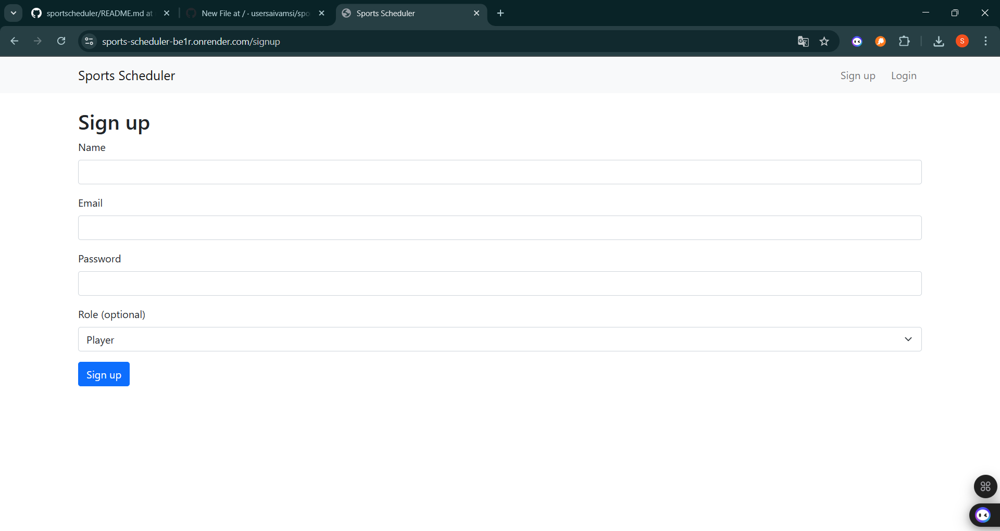

🏀 SportsScheduler

SportsScheduler is a web application that allows users to create, join, and manage sports sessions. It helps players organize games, track participants, and manage cancellations easily.

🚀 Features

User authentication and session-based login

Create sports sessions with teams, venue, and schedule

Join or cancel participation in a session

Session creator can cancel sessions with a reason

Simple and responsive interface built with EJS templates

🛠 Tech Stack

Backend: Node.js, Express.js

Frontend: EJS, HTML, CSS

Database: MongoDB (Mongoose ODM)

Authentication: Express-session

Deployment: Render

🌍Some screenshots of website

  <h2>Signup</h2>
  
  <h2>Login</h2>
  
  <h2>Admin interface</h2>
  
   <h2>User interface</h2>
  
  <h2>Session creation</h2>
  

🔗 Website link: [sport-scheduler](https://sports-scheduler-be1r.onrender.com/sessions)
